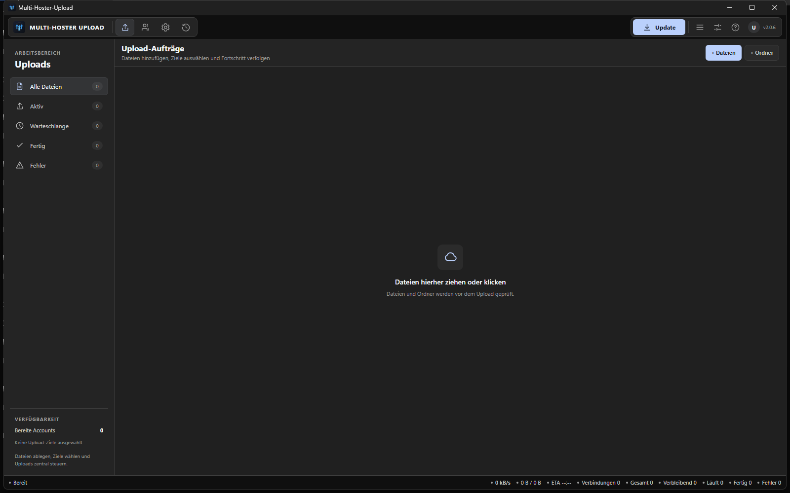
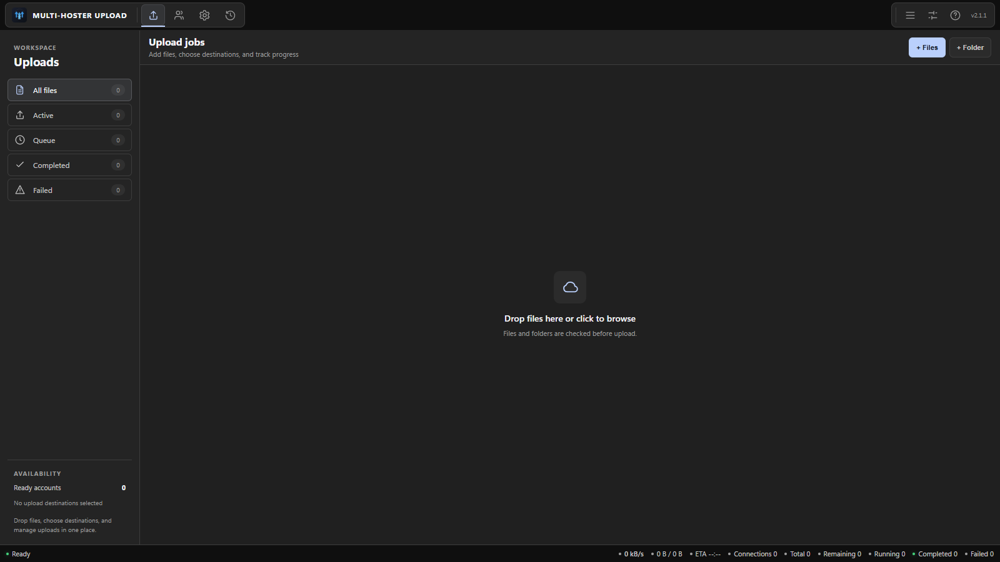
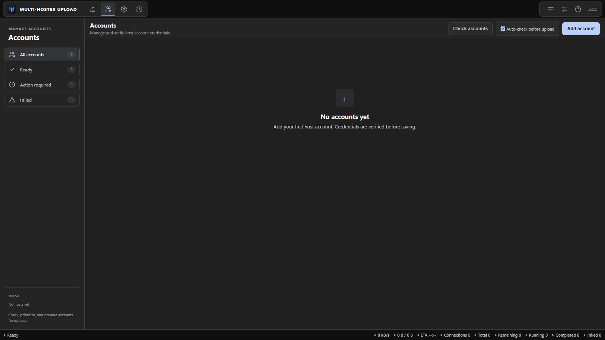
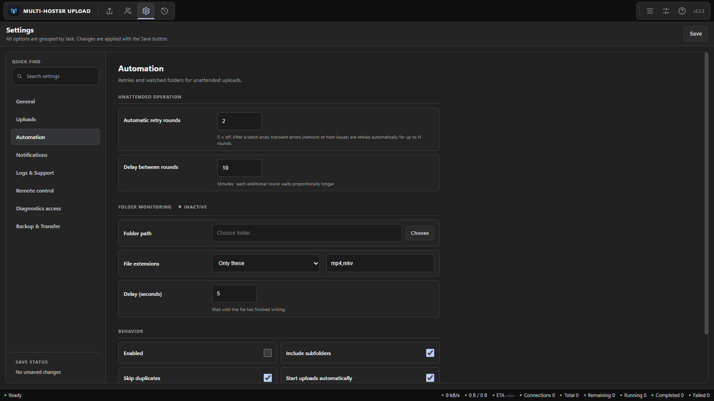
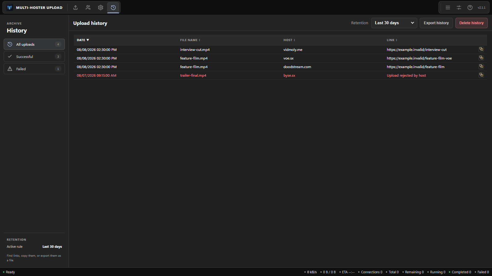

# Multi-Hoster-Upload

Multi-Hoster-Upload is a Windows desktop application for sending file batches to several supported video hosts from one queue. Add files or folders, choose one or more destinations, manage multiple accounts, and follow every upload from preparation to its final link.



## Download

Download the current Setup or Portable build from the [latest GitHub release](https://github.com/Sucukdeluxe/Multi-Hoster-Upload/releases/latest).

The latest public release is version 2.1.39. Use the release page for the executables and the full English changelog.

## Features

### Upload workspace

- Add individual files, complete folders, or files by drag and drop.
- Review candidates, duplicates, unavailable files, accepted files, destinations, resulting jobs, and configured size-limit omissions before confirming an import.
- Build one job per selected file and destination.
- Upload to several supported hosts from the same queue.
- Filter the workspace by all, active, queued, completed, or failed jobs.
- Search and filter queue entries by file name, host, and status.
- Open per-upload diagnostics with the selected account, retry count, and safe error details.
- Track status, smoothly interpolated progress, transferred size, speed, and the selected host account.
- Track the remaining upload size as queued and active files progress or return for a retry.
- Read total, remaining, running, completed, and failed upload activity from the persistent sidebar telemetry.
- Follow current upload speed in the sidebar and the synchronized header graph.
- Reorder selected jobs, start selected jobs, retry finished jobs, or stop active work.
- Copy completed links individually or together.
- Keep formatted link logs separate from source-cleanup and upload-plan audit records.

### Accounts and automation

- Keep multiple named accounts for each host.
- Validate credentials before a new or edited account is saved.
- Run health checks for one account or all configured accounts.
- Complete an OTP check in the account view when a host requests it.
- Enable, disable, prioritize, and reorder accounts.
- Rotate files across enabled accounts or keep the first enabled account as the primary account.
- Switch to an available fallback account when an account-specific upload error is detected.
- Apply retries, concurrency, bandwidth, file-size, and pacing settings per host.
- Monitor a folder for new files and start matching uploads automatically.

### History, transfer, and updates

- Restore unfinished queue entries after restarting the application.
- Keep upload history entries and filter the archive by all, successful, or failed views.
- Retain all history, a time window, or the latest 100 or 1,000 uploads.
- Export history as CSV or JSON.
- Export a per-session CSV or JSON report with host success rates, duration, bytes, attempts, and errors.
- Clearly mark interrupted uploads after a restart so they can be resumed deliberately.
- Use the complete interface in English or German and switch at runtime.
- Export settings locally or transfer them with an encrypted online backup key.
- Send a batch summary to a Discord webhook or another HTTP webhook.
- Check for application updates and read the matching GitHub release changelog in the update dialog.

## Supported hosts and authentication

| Host | Web login | API key |
| --- | :---: | :---: |
| Doodstream | Yes | Yes |
| VOE | Yes | Yes |
| Vidmoly | Yes | No |
| Byse | No | Yes |
| Clouddrop | No | Yes |

Doodstream uses the API key when an account contains both an API key and web-login credentials. VOE web login expects an email address. Only enabled accounts with the required credentials are available as upload destinations.

## Install or run portable

The release page contains two Windows builds:

- **Setup** installs the application for the current Windows user. It lets you choose the installation directory and can create a desktop shortcut.
- **Portable** runs directly without an installer. Move the executable wherever you want and launch it from there.

Both builds use the same application features. Portable refers to the executable package; application settings, queue state, and history still use Electron's user-data directory rather than a folder beside the executable.

## First upload



1. Open **Accounts** and select **Add account**.
2. Choose the host and authentication method shown in the table above.
3. Enter the credentials and select **Verify and add**. If the host requests an OTP, enter it before continuing.
4. Return to **Uploads** and add files, add a folder, or drop files into the workspace.
5. Select one or more available destinations. The application creates a queue preview for each file and host combination.
6. Review the jobs and start the complete queue or only the selected jobs.
7. Follow progress in the queue. Completed rows expose their generated links, which can be opened or copied.

Files and folders are checked before upload. A job can also be skipped by a configured maximum file size before any upload starts.

## Account management and rotation



Each host can contain several accounts. Accounts can have a label, can be enabled or disabled, and can be reordered within their host group. The first enabled account with usable credentials is the primary account.

Turn on **Rotate accounts** in a host's upload settings to distribute files round-robin across all enabled accounts for that host. With rotation off, the primary account remains selected. Rotation has no effect when only one usable account exists.

Account checks show ready, warning, OTP-required, checking, or failed states. An automatic check runs when the application starts, and checks can also be started manually for one account or all accounts. The application does not run a separate account check immediately before each upload batch. During a batch, account-specific failures can mark an account unavailable for that session and move work to a usable fallback. Transient network or host errors stay in the normal retry path instead of disabling the account.

## Queue, concurrency, rate controls, and recovery

### Concurrency and bandwidth

The application combines global controls with settings for each host:

- **Global parallel uploads:** `0` keeps only the per-host limits; `1` to `100` caps total concurrency across hosts.
- **Per-host parallel uploads:** limits simultaneous jobs for that host from `1` to `100`.
- **Global speed limit:** caps combined upload throughput in MB/s; `0` is unlimited.
- **Per-host speed limit:** caps that host's throughput in MB/s; `0` is unlimited.
- **Interval:** waits the configured number of seconds between jobs for a host.
- **Restart below:** restarts an upload when its measured speed remains below the configured kB/s threshold; `0` disables the check.
- **Maximum size:** skips files above the per-host MB limit; `0` is unlimited.

When automatic scaling is enabled and a global parallel limit is set, each per-host parallel limit is capped at that global limit. It does not distribute parallel slots across accounts.

### Retries and recovery

Each host has its own retry count. A job reports the retrying state while another attempt is being prepared. After a batch ends, optional automatic retry rounds can retry transient failures with a progressively longer delay.

Queue state is saved while you work and again during a normal application close. When **Restore queue at launch** is enabled, unfinished jobs return as ready queue entries after a restart. Start the restored jobs manually. Jobs that the upload log proves were already completed after the saved snapshot are removed from the restored queue to avoid an immediate duplicate.

Successful jobs can remain visible or be removed automatically. History is stored separately, so removing a completed row from the active queue does not remove its history entry.

### Permanent source cleanup

**Settings > Uploads** can permanently delete a source file after every destination selected for that file has completed successfully. This option is disabled by default and requires an explicit warning confirmation before it can be enabled.

Cleanup remains blocked while any required destination is unfinished, failed, canceled, skipped, or missing valid confirmation. The application records the original file identity, preserves successful destinations across retries and restarts, waits for active file handles to close, and refuses deletion if the source was replaced or modified. Every cleanup decision and result is written to the upload log. Deletion bypasses the Recycle Bin and cannot be undone.

## Folder monitoring



Folder monitoring watches for new files while the application is running. Configure it under **Settings > Automation**:

1. Choose the folder and decide whether subfolders are included.
2. Use an include or exclude extension list such as `mp4,mkv`.
3. Set a write-completion delay so partially copied files are not queued too early.
4. Choose whether duplicate file events are ignored during the current monitoring session.
5. Set the maximum automatic queue size. The default is `15,000` jobs; `0` means unlimited.
6. Select a reconciliation interval of 1, 5, 15, 30, or 60 minutes. The default is 5 minutes.
7. Select the destination hosts and decide whether matching jobs start automatically.
8. Enable monitoring and save the settings.

The status card summarizes the complete automation state. **Inactive** means monitoring is disabled or has no usable path. **Active** means monitoring is enabled and configured and no higher-priority paused, disconnected, error, or queue-limit state currently applies. **Paused** means the persistent manual pause is in effect. **Queue limit reached** means matching files are being deferred until capacity becomes available. **Folder disconnected** means the configured folder is currently missing or unreadable and will be checked again. **Error** reports another monitoring failure. The card also shows reachability, current queue use, today's counters, the latest detected file, reconciliation times, and the latest error when one exists.

**Test folder monitoring** performs a read-only full scan with the current folder, filter, subfolder, destination, size-limit, processed-file, and queue-limit rules. It reports aggregate counts without changing the queue, selected files, telemetry, history, logs, source files, settings, or the one-time existing-file option.

The automatic queue limit counts preview, queued, server-selection, uploading, and retrying jobs. Manual imports remain available and also consume queue capacity. Admission is file-atomic: all eligible destination jobs for one file are admitted together, or the complete file is deferred. A deferred file is reconsidered by a later reconciliation after capacity becomes available. Setting the limit to `0` disables this automatic backpressure.

New matching files are collected after they have remained stable for the configured delay. The optional one-time existing-file scan, live watcher events, interval scans, and reconnect scans use the same filtering and admission path. Reconciliation checks the complete folder at the selected interval. A missing folder keeps its configuration; after it becomes reachable again, exactly one reconnect scan runs before normal interval scans continue. If no hosts are preselected, the application asks for destinations instead of starting a batch automatically.

**Finish and pause** saves the pause before allowing active uploads to finish. While paused, no watcher, reconciliation, queued upload start, automatic start, or active-batch injection can proceed. Manual files can still be imported as preview jobs. The pause survives an application restart. **Resume** explicitly removes it, restarts monitoring, and performs one reconciliation without automatically starting existing preview jobs.

For automation decisions, **already processed** describes current evidence only: exact paths in the current queue, successful history results, and successful entries in the application's upload log. It is not a permanent file registry. A basename-only match is accepted only when it identifies one candidate unambiguously; same-named files from different folders remain eligible unless exact current evidence identifies them.

## History, retention, links, and export



History keeps completed, failed, stopped, and skipped results in a separate archive. Only a `done` result represents a successful upload; a `skipped` result records a job that was not uploaded. The current **Successful** view also includes skipped jobs even though they were not uploaded. Filter the archive by all, successful, or failed views; sort the table; open a generated link; or copy one link directly from its row.

Retention choices are:

- Keep everything.
- Keep the last 7, 30, or 90 days.
- Keep the latest 100 or 1,000 uploads.

Changing to a stricter rule previews how many rows will be removed and asks for confirmation. New history entries are pruned against the active rule. **Export history** saves the archive as CSV or JSON. Deleting history is permanent and requires confirmation.

## English and German

English is the default language for new profiles. Open **Settings > General** to switch between English and German. The visible interface updates immediately without restarting the application, including dynamically rendered lists, dialogs, status text, placeholders, titles, and accessibility labels. The selected language is saved for the next launch.

## Backup, security, and privacy

### Local data and credentials

Settings, pending queue state, and upload history are stored in Electron's user-data directory. Passwords and API keys must be encrypted with Electron `safeStorage` before they are written. On Windows, `safeStorage` uses DPAPI and ties encrypted values to the current Windows user profile. If operating-system encryption is unavailable or encryption fails, the write is rejected and credentials are never written as plaintext. Legacy plaintext credentials remain readable for migration and are encrypted during the next successful save.

Credentials are decrypted when required for account validation or upload to the selected host. Do not share application data files, backup files, screenshots containing credentials, or generated backup keys.

### Local backup

The Backup menu can export and import accounts and settings:

- `.mhu` uses an authenticated AES-256-GCM envelope with an app-wide built-in key. This detects modified or corrupted data and prevents accidental plaintext viewing, but it does not protect the backup from someone who has the application or its source code.
- `.json` is an explicit plaintext export. It can contain host credentials and must be protected accordingly.

Both backup formats can contain credentials. Protect `.mhu` files like credentials even though their contents are not directly readable as plaintext. Local backups exclude upload history and the pending queue. When importing on another computer, unavailable log or monitored-folder paths are cleared; folder monitoring is disabled if its saved path does not exist.

### Encrypted online transfer

Online backup is optional and transfers accounts and settings only. The application creates a 75-character key, encrypts the backup on the client with AES-256-GCM, and uploads only the encrypted blob. The service does not receive the decryption key. Queue state and history are not included.

Treat the generated key like a password: anyone with it can restore the encrypted settings. Creating a new key does not invalidate older keys.

### Other network activity

- Uploads and credential checks communicate with the host you selected.
- Update checks retrieve release metadata, and the dialog loads the matching changelog from GitHub when available.
- Webhook notifications are sent only when you configure a webhook URL. Discord endpoints receive a formatted summary in the selected interface language; other endpoints receive JSON.
- Online backup traffic occurs only when you create or restore an online backup.

## Updates and changelog

Open **Settings > General** or **Help** and select **Check for updates**. When a newer version is available, the application shows the installed and available versions, download progress, and release notes. The update dialog requests the changelog for the matching version from the public GitHub release and uses the release's fallback description if that changelog is unavailable.

The downloaded Setup executable is checked as a Windows executable. When `latest.yml` contains a SHA-512 value, the downloaded file is also checked against it before installation starts.

You can always install manually from the [GitHub releases page](https://github.com/Sucukdeluxe/Multi-Hoster-Upload/releases).

## Troubleshooting

### No destination is available

- Open **Accounts** and confirm that at least one account is enabled.
- Check that its authentication method matches the supported-host table.
- Run the account check again and complete any requested OTP step.
- Add the account again if validation fails; invalid new credentials are not saved.

### The upload button stays disabled

- Add at least one file or folder.
- Select at least one host with an enabled account and usable credentials.
- Check whether a configured maximum file size skipped every preview job.

### Uploads retry or fail repeatedly

- Open the job log for the concrete host response.
- Recheck the account in **Accounts**.
- Reduce global or per-host concurrency.
- Review the per-host retry count, speed threshold, interval, and size limit.
- A low-speed restart reuploads the job; disable **Restart below** by setting it to `0` when it is not needed.

### A queue was interrupted

- Keep **Restore queue at launch** enabled before closing the application.
- Restart the application and review the restored ready jobs.
- Start those jobs manually after confirming the files still exist.
- Completed jobs may be removed automatically when they are already present in the upload log.

### Folder monitoring does not add a file

- Confirm that monitoring is enabled and the selected folder still exists.
- Check the status card for a persistent pause, a disconnected folder, an error, or a full automatic queue.
- Use **Test folder monitoring** to inspect the current read-only classification.
- Enable the one-time existing-file option when files already present at activation should be considered.
- Check the include or exclude extension list and the subfolder option.
- Wait for the configured write-completion delay.
- Confirm that at least one destination host is selected if automatic start is enabled.

### History or backup export does not appear

- History export is unavailable when the history is empty.
- Check the destination selected in the Windows save dialog.
- Both `.mhu` and `.json` backups can contain credentials. Protect either format like credentials.
- `.mhu` uses AES-256-GCM with an app-wide built-in key. It prevents direct plaintext viewing but does not protect the backup from someone who has the application or its source code. `.json` stores the same backup data as plaintext.
- Queue state and history are not part of settings backups.

### Update checking fails

- Check the internet connection and try again after active uploads finish.
- Use the [latest release page](https://github.com/Sucukdeluxe/Multi-Hoster-Upload/releases/latest) for a manual download.
- If the changelog cannot be loaded, the application can still show the fallback release description when one is available.

## Development and Windows builds

Install dependencies and start the Electron application:

```powershell
npm install
npm start
```

Run the test suite and lint checks:

```powershell
npm test
npm run lint
```

Create both Windows release targets without publishing them:

```powershell
npm run release:win
```

The release command builds the NSIS Setup executable and the Portable executable into `release/`.
